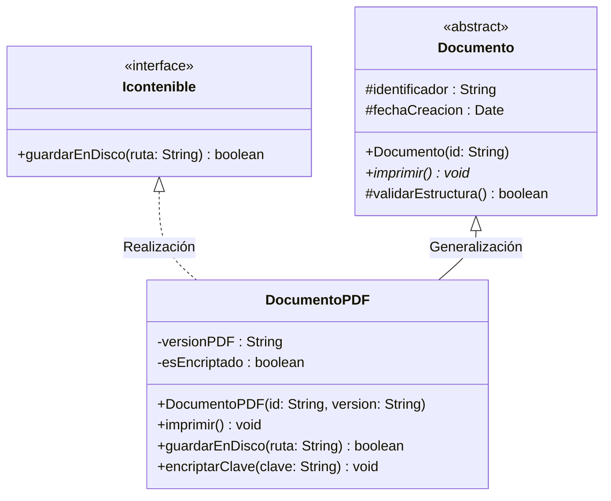
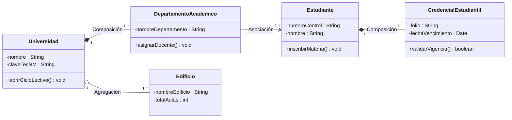
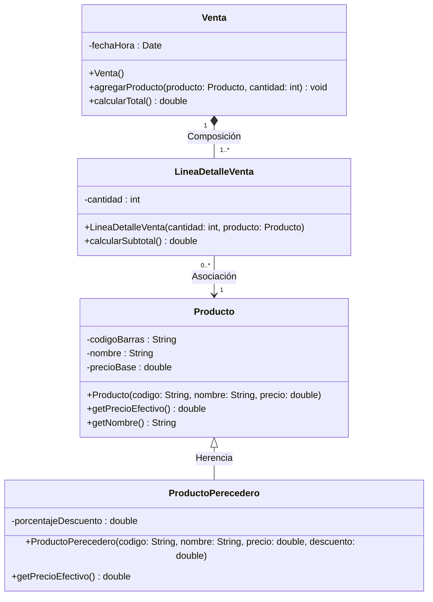

# Lenguaje de Modelado Unificado

## 3.1 Sintaxis y Notación UML de Clases

El **Lenguaje de Modelado Unificado (UML)** es una notación estándar para la representación visual, construcción y documentación de sistemas orientados a objetos.

En los diagramas de clases, una clase se representa mediante una figura rectangular estructurada en tres compartimentos:

1. **Compartimento superior — Nombre:** contiene el nombre formal de la clase escrito normalmente en convención `PascalCase`. Las clases abstractas pueden diferenciarse mostrando el nombre en cursiva o mediante la etiqueta `<<abstract>>`.
2. **Compartimento intermedio — Atributos:** enumera las variables de estado declarando visibilidad, nombre, tipo de dato y, de manera opcional, un valor inicial.
3. **Compartimento inferior — Métodos:** define las operaciones indicando visibilidad, nombre, parámetros y tipo de retorno.

### Formatos generales

Atributo:

```text
visibilidad nombre : TipoDato
```

Método:

```text
visibilidad nombre(parametro : Tipo) : TipoRetorno
```

### Simbología formal de visibilidad UML

- `+` **Public:** accesible universalmente.
- `-` **Private:** encapsulado dentro de la propia clase.
- `#` **Protected:** accesible por la clase y sus subclases.
- `~` **Package:** accesible únicamente dentro del paquete local.

---

## 3.2 Relaciones entre Clases en UML

Las conexiones semánticas entre clases se clasifican según la naturaleza de la relación y el ciclo de vida de los objetos participantes.

### Asociación

Representa una relación estructural donde los objetos de una clase conocen a los de otra.

Se representa mediante una **línea continua** y puede incluir:

- navegabilidad;
- multiplicidades como `1`, `0..*`, `1..*`.

### Agregación

La **agregación** representa una relación "Todo-Parte" débil donde las partes pueden existir de forma independiente del objeto contenedor.

Se representa con un **rombo hueco** en el extremo de la clase contenedora.

### Composición

La **composición** representa una relación "Todo-Parte" fuerte con dependencia de existencia.

Si el objeto contenedor es destruido, las partes que dependen de él dejan de existir dentro del modelo.

Se representa con un **rombo relleno** en el extremo del contenedor.

### Generalización o Herencia

Representa la relación de especialización entre una subclase y una superclase.

Se dibuja mediante una **línea continua** que termina en una punta triangular hueca orientada hacia la superclase.

---

## 3.3 Diagramas UML en Sintaxis Mermaid

Los siguientes diagramas se expresan en sintaxis Mermaid para facilitar su incorporación en entornos compatibles.

### Diagrama 1: Clase, interfaz y herencia



### Diagrama 2: Relaciones de dominio — Sistema universitario integrado



> **Nota para GitHub Pages:** el renderizado directo de Mermaid depende del tema o generador utilizado. En MkDocs con soporte Mermaid funciona de forma directa; en GitHub Pages con Jekyll puede requerirse habilitar Mermaid mediante el tema, un plugin compatible o JavaScript.

---

## 3.4 Caso de Estudio Práctico: Sistema de Punto de Venta

### Especificación del problema

Se requiere diseñar el núcleo de un sistema para un **Punto de Venta**.

Una `Venta` procesa transacciones asociando múltiples renglones de `LineaDetalleVenta`. Cada línea especifica una cantidad comprada y se vincula a un `Producto`.

Los productos poseen:

- código de barras;
- nombre;
- precio base.

Además, la tienda maneja `ProductoPerecedero`, el cual hereda de `Producto` e introduce un porcentaje de descuento especial.

### Diagrama de clases UML



### Implementación del modelo en Java

> El documento fuente presenta estas clases como una implementación conceptual conjunta. En un proyecto Java real, las clases públicas normalmente se guardarían en archivos separados.

#### `Producto.java`

```java
package com.tecnm.poo.unidad3.casestudy;

import java.util.Objects;

public class Producto {

    private final String codigoBarras;
    private final String nombre;
    private final double precioBase;

    public Producto(
            String codigoBarras,
            String nombre,
            double precioBase) {

        this.codigoBarras = Objects.requireNonNull(
                codigoBarras,
                "El código es obligatorio."
        );

        this.nombre = Objects.requireNonNull(
                nombre,
                "El nombre es obligatorio."
        );

        this.precioBase = precioBase;
    }

    public double getPrecioEfectivo() {
        return this.precioBase;
    }

    public String getCodigoBarras() {
        return codigoBarras;
    }

    public String getNombre() {
        return nombre;
    }
}
```

#### `ProductoPerecedero.java`

```java
package com.tecnm.poo.unidad3.casestudy;

class ProductoPerecedero extends Producto {

    private final double porcentajeDescuento;

    public ProductoPerecedero(
            String codigo,
            String nombre,
            double precio,
            double porcentajeDescuento) {

        super(codigo, nombre, precio);
        this.porcentajeDescuento = porcentajeDescuento;
    }

    @Override
    public double getPrecioEfectivo() {
        double precioOriginal = super.getPrecioEfectivo();

        return precioOriginal
                - (precioOriginal * (this.porcentajeDescuento / 100.0));
    }
}
```

#### `LineaDetalleVenta.java`

```java
package com.tecnm.poo.unidad3.casestudy;

import java.util.Objects;

class LineaDetalleVenta {

    private final int cantidad;
    private final Producto producto;

    public LineaDetalleVenta(
            int cantidad,
            Producto producto) {

        if (cantidad <= 0) {
            throw new IllegalArgumentException(
                    "La cantidad debe ser mayor a cero."
            );
        }

        this.cantidad = cantidad;

        this.producto = Objects.requireNonNull(
                producto,
                "El producto es obligatorio."
        );
    }

    public double calcularSubtotal() {
        return this.cantidad
                * this.producto.getPrecioEfectivo();
    }
}
```

#### `Venta.java`

```java
package com.tecnm.poo.unidad3.casestudy;

import java.util.ArrayList;
import java.util.Date;
import java.util.List;

public class Venta {

    private final Date fechaHora;
    private final List<LineaDetalleVenta> detalles;

    public Venta() {
        this.fechaHora = new Date();
        this.detalles = new ArrayList<>();
    }

    public void agregarProducto(
            Producto producto,
            int cantidad) {

        this.detalles.add(
                new LineaDetalleVenta(cantidad, producto)
        );
    }

    public double calcularTotal() {
        double total = 0.0;

        for (LineaDetalleVenta linea : detalles) {
            total += linea.calcularSubtotal();
        }

        return total;
    }

    public Date getFechaHora() {
        return fechaHora;
    }
}
```

---

## 3.5 Tip de Industria

> **Regla de modelado de dominio:** evitar incluir claves ajenas relacionales (*Foreign Keys*) en la sección de atributos de un diagrama de clases UML conceptual.

Un error frecuente consiste en incorporar atributos como:

```text
id_departamento_fk
codigo_cliente_fk
```

para representar conexiones entre entidades.

En un modelo orientado a objetos, las relaciones entre clases se representan mediante asociaciones, agregaciones, composiciones o generalizaciones. En la implementación, dichas relaciones suelen traducirse en referencias entre objetos.

Incorporar claves ajenas directamente en el modelo conceptual mezcla detalles de persistencia relacional con el diseño del dominio.

---

## 3.6 Reto / Ejercicio Rápido para el Alumno

Diseñe en sintaxis Mermaid el diagrama de clases para un **Sistema de Control de Biblioteca Universitaria**.

Debe considerar:

- `Biblioteca`
- `Libro`
- `Prestamo`
- `Usuario`

Requisitos:

1. Establezca una **composición** entre `Biblioteca` y `Libro`.
2. Establezca una **asociación** entre `Usuario` y `Prestamo` con multiplicidad `1` a `0..*`.
3. Vincule cada `Prestamo` con exactamente `1` `Libro`.
4. Verifique que los atributos utilicen visibilidad privada `-`.
5. Verifique que los métodos expongan firmas públicas `+` con sus tipos de datos correspondientes.

---

## Referencias

1. `AED-1286_Programacion_Orientada_a_Objetos (1).pdf`
2. *Java How to Program Early Objects*, 11e (2021).
3. Craig Larman, *UML y Patrones*, 2.ª ed.
4. Joshua Bloch, *Effective Java*, 3rd Edition.
